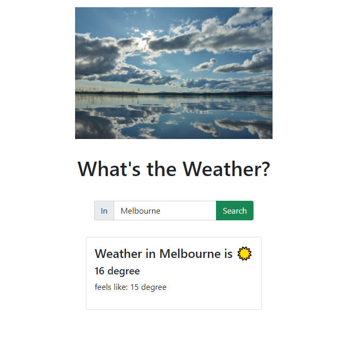

# Weather App

## Description
This is a project to create a weather App using all the things I have learnt so far.

### Technology I used
- HTML
- CSS
- Bootstrap
- JavaScript
- DOM
- APIs
- [OpenWeather API](https://openweathermap.org/current)

### What I learnt from this exercise
- Async/await: how to use this when I fetch data using APIs
- DOM events
- Dot notation to get data that was needed
